# 🛒 NPle
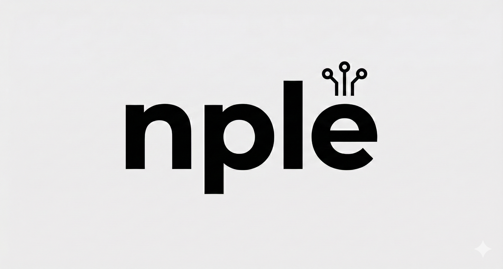
> **"함께 사면 더 싸다!"**
> 실시간 공동구매 딜과 그룹 매칭을 지원하는 이커머스 플랫폼입니다.

## 🛠️ 기술 스택

### DBMS

### Infrastructure & Load Balancing

### 협업 & 기타

 

---

## 👥 1. 팀원 소개 (Team Members)

| 이름 | GitHub |
| :---: | :---: |
| **강신우** | [@shinukang](https://github.com/shinukang) |
| **이후경** | [@sarapoba](https://github.com/sarapoba) |
| **박범수** | [@pbgodsoo](https://github.com/pbgodsoo) |
| **이재혁** | [@hijaehyuk](https://github.com/hijaehyuk) |

---

## 📖 2. 프로젝트 개요 (Project Overview)

- 프로젝트 개요: 기존 이커머스의 직관적인 UX에 '공동구매' 방식을 결합하여, 특정 목표 인원이 모이면 자동으로 할인된 가격에 구매할 수 있는 플랫폼입니다.
- 기대 효과: 소비자는 복잡한 절차 없이 가격 혜택을 누리고, 판매자는 대량 판매를 통한 재고 소진과 안정적인 수익 구조를 확보하는 상생 모델을 지향합니다.
- 핵심 프로세스: 사용자는 별도의 리스크 없이 구매 예약을 진행하며, 목표 인원 달성 시에만 자동 결제가 이루어지고 미달 시에는 자동으로 취소되는 시스템입니다.

🔗 **프로젝트 상세 내용 확인하기** > [📑 프로젝트 기획안](https://github.com/beyond-sw-camp/be24-1st-Error404-NPle/blob/3b6ce68d9fc43252af19eeb40fd36a8b3319f5b1/docs/Error404_%ED%94%84%EB%A1%9C%EC%A0%9D%ED%8A%B8%20%EA%B8%B0%ED%9A%8D%EC%95%88.pdf)

---

## 📋 3. 요구사항 명세 (Requirements Specification)

🔗 **요구사항 명세서 상세 내용 확인하기** > [📑 요구사항 명세서](https://github.com/beyond-sw-camp/be24-1st-Error404-NPle/blob/3b6ce68d9fc43252af19eeb40fd36a8b3319f5b1/docs/NPle_%EC%9A%94%EA%B5%AC%EC%82%AC%ED%95%AD%20%EC%A0%95%EC%9D%98%EC%84%9C_1.0.pdf)

---

## 📐 4. ERD (Entity Relationship Diagram)

데이터베이스의 논리적/물리적 설계도입니다.
*(클릭하면 확대해서 볼 수 있습니다)*

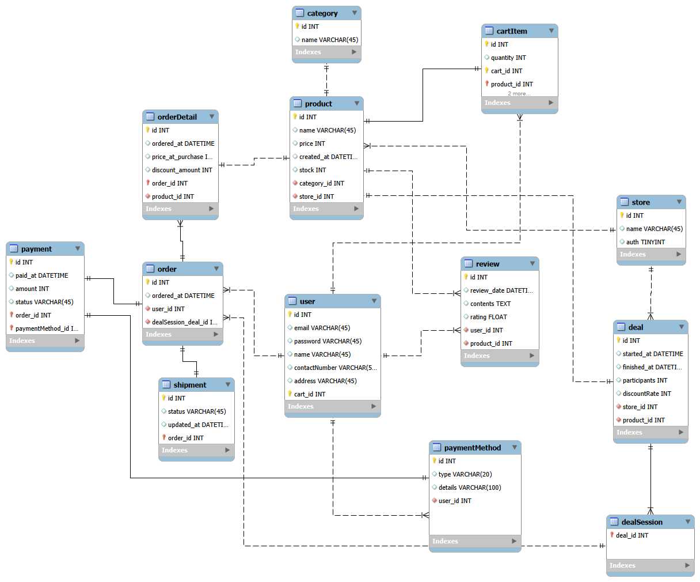

[📑 테이블 명세서](https://github.com/beyond-sw-camp/be24-1st-Error404-NPle/blob/main/docs/NPle_%ED%85%8C%EC%9D%B4%EB%B8%94%20%EC%A0%95%EC%9D%98%EC%84%9C.pdf)

---

## 🏗️ 5. 시스템 아키텍처 (System Architecture)

서버 인프라 및 기술 구성도입니다.

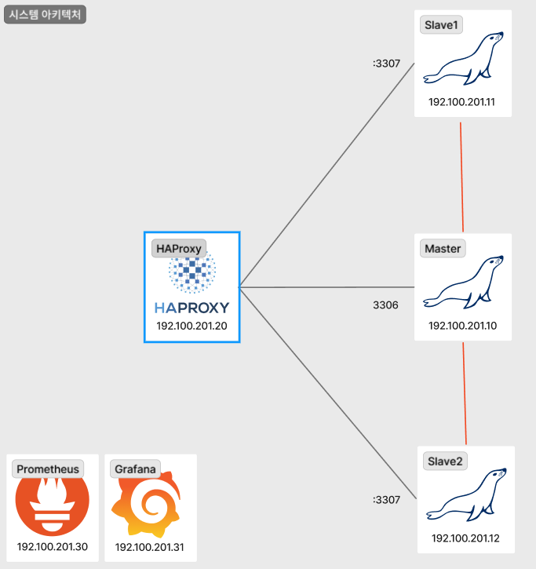

* **Database:** MariaDB (Master-Slave 구조)
* **Infra:** Linux (Ubuntu 22.04 LTS) 

 
<strong>📌 아키텍처 설계 설명 보기</strong>
  

이커머스 서비스의 특성상 조회 트래픽이 압도적으로 많기 때문에, 이를 슬레이브 서버로 분산 처리하여 마스터 서버의 부하를 줄이고 전체적인 응답 속도를 향상시키는 구조입니다. HAProxy를 통해 트래픽을 유연하게 분산함으로써 특정 서버에 장애가 발생하더라도 서비스 중단 없이 안정적인 운영이 가능하도록 해당 구조를 채택했습니다.

특히 공동구매가 특정 시간에 오픈될 경우, 짧은 시간 동안 다수의 사용자가 동시에 접속하여 상품 상세 정보와 옵션을 조회하는 대량의 SELECT 요청이 발생합니다. 이러한 트래픽 급증 상황에서도 슬레이브 서버를 수평적으로 확장하는 것만으로 유연하게 대응할 수 있다는 장점이 있습니다.

---

## 6. 기능별 SQL

---

## 💡 7. 부하테스트 전후 차이 

  
<strong>📉 반정규화 설계 (성능 최적화)</strong>

  

| 대상 테이블 | 추가 컬럼 (Column) | 기대 효과 (Benefit) |
| :--- | :--- | :--- |
| **deal** | `current_participants_count`   `status` | • 실시간 인원 집계(`COUNT`) 쿼리 제거 • DB 부하 감소 및 조회 속도 향상 |
| **product** | `review_avg_rating`   `review_count` | • 리뷰 테이블 조인/집계 연산 제거 • 상품 리스트 로딩 속도 **대폭 개선** |
| **order** | `total_amount` | • 주문 상세 내역 합산(`SUM`) 연산 제거 • 매출 통계 및 내역 확인 효율화 |
  
 반정규화 후 ERD 

  

    
  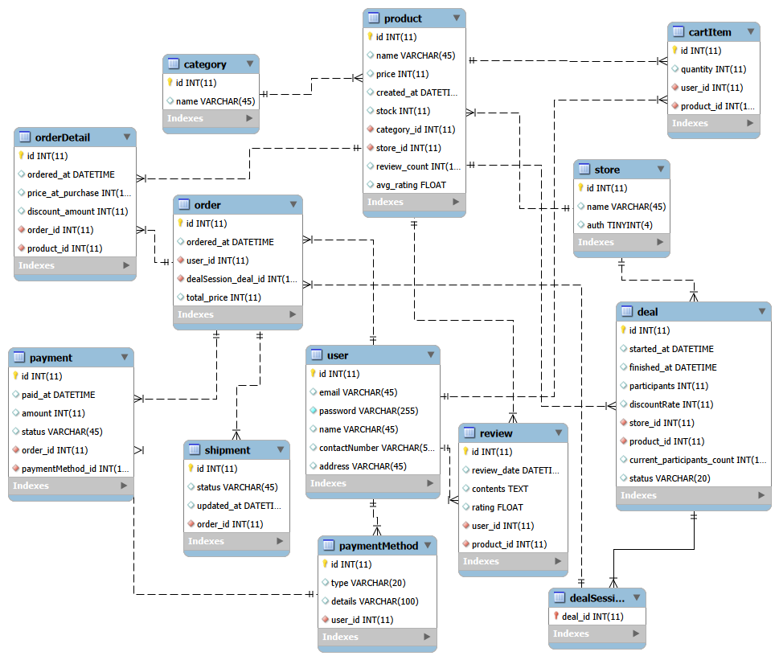

  

  
1번 상품 리스트 조회 

  

  <pre>
SELECT 
    p.id, 
    p.name AS product_name, 
    p.price, 
    p.stock, 
    c.name AS category_name, 
    s.name AS store_name
FROM product p
JOIN category c ON p.category_id = c.id
JOIN store s ON p.store_id = s.id
ORDER BY p.created_at DESC; 
  </pre>
- 인덱스 추가
<pre>
1. 정렬(created_at)을 우선으로 하되, 조인에 필요한 외래키들을 포함
  CREATE INDEX idx_product_list_flow ON product(created_at DESC, category_id, store_id);
2. 카테고리로 먼저 모으고, 그 안에서 상점 ID와 가격 정보를 포함
  CREATE INDEX idx_product_cat_search ON product(category_id, store_id, price);
</pre>
    
  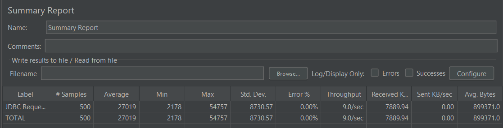
    
   
    
 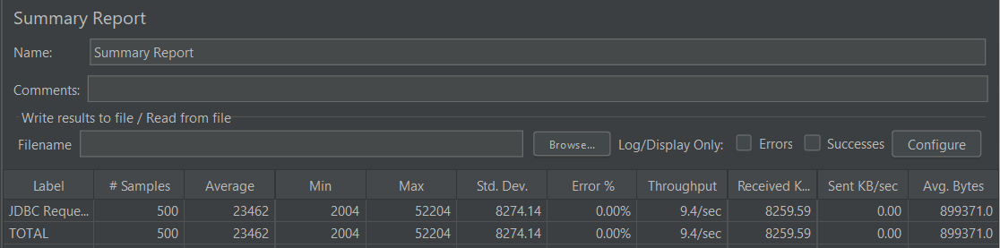

 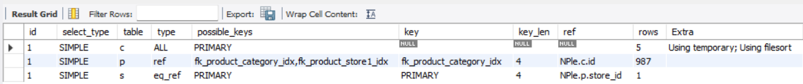

  
    
 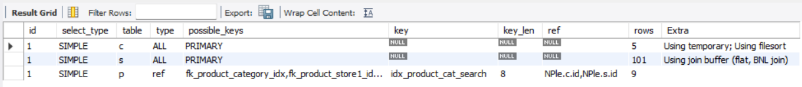

  

  
2번 특정 상품 조회 

  <pre>
SELECT * FROM NPle.product 
WHERE price BETWEEN 10000 AND 50000;
  </pre>
- 인덱스 추가
<pre>
1. product 테이블의 price 컬럼에 인덱스 추가
CREATE INDEX idx_product_price ON NPle.product(price);
</pre>
  

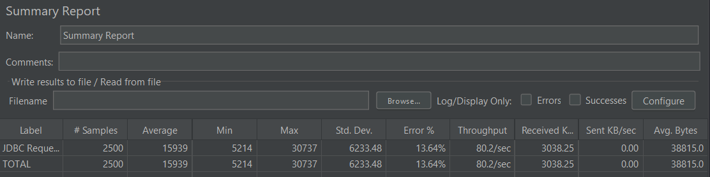

 

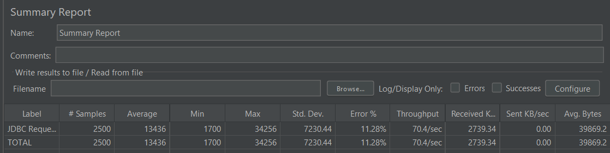 

 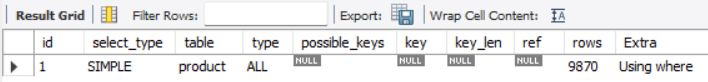

  
    
 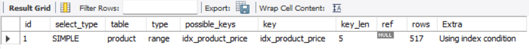
  

